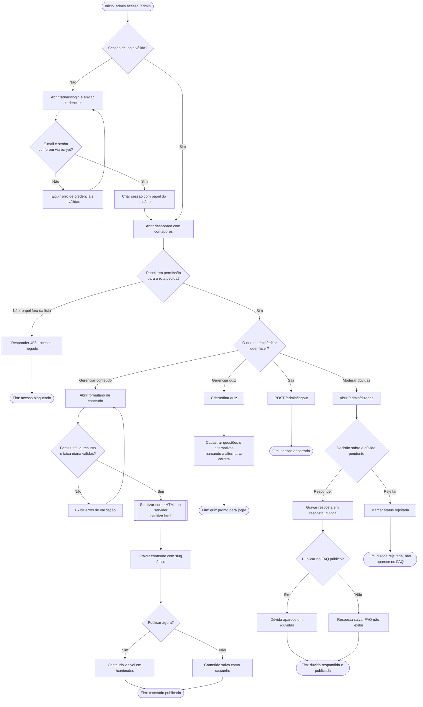

# BPMN — Fluxo do administrador/editor

Raias: **Admin/Editor** e **Sistema (servidor)**.

## Notas do fluxo

- O gateway **"Papel tem permissão para a rota pedida?"** corresponde a
  `auth.middleware.js#requireRole` (RF05) — coberto por
  `tests/auth.middleware.test.js`.
- O sub-processo **"Sanitizar corpo HTML no servidor"** corresponde a
  `conteudo-admin.service.js` com `sanitize-html` (RF06) — coberto por
  `tests/conteudo-admin.service.test.js`.
- O caminho de moderação de dúvida (**responder → publicar/ocultar** ou
  **rejeitar**) nunca expõe nenhum dado de quem perguntou ao admin — a tabela
  `duvida` não guarda essa informação (RNF08), então não há atividade possível
  nesse fluxo que vaze identidade do visitante.
