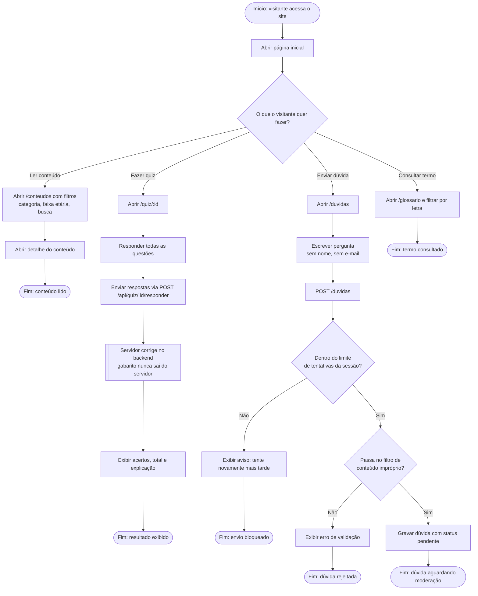

# BPMN — Fluxo do visitante (anônimo)

Notação: evento de início/fim em círculo, atividade em retângulo, decisão em
losango — equivalente às formas BPMN padrão (Start Event, Task, Gateway),
desenhado em Mermaid para renderizar direto no GitHub sem ferramenta externa.

Raias (swimlanes): **Visitante** e **Sistema (servidor)**.

## Notas do fluxo

- O gateway **"Passa no filtro de conteúdo impróprio?"** corresponde a
  `duvida.service.js#contemConteudoBloqueado` (RF10) — coberto por
  `tests/duvida.service.test.js`.
- O gateway **"Dentro do limite de tentativas da sessão?"** corresponde a
  `rate-limit.middleware.js#limitarPorSessao` (RF11) — coberto por
  `tests/rate-limit.middleware.test.js`.
- A atividade **"Servidor corrige no backend"** é destacada como sub-processo
  porque é o ponto de maior sensibilidade de segurança do fluxo público: o
  gabarito (`alternativa.correta`) nunca trafega para o navegador antes do
  envio da resposta (RF07) — coberto por `tests/quiz-player.service.test.js`.
- Em nenhum ponto deste fluxo o visitante se identifica — não há tela de login
  nem campo de nome/e-mail em qualquer atividade da raia "Visitante".
